# chakravat

cyclone detection, classification and forecasting for the north indian ocean.
built for SIH problem statement 26070 (ministry of earth sciences / IMD).

The problem statement (sih2026 26070) asks for identification, classification and prediction
from multi-source satellite data. We split that into four tasks:

- T1, find storms in a satellite image and pin the centre
- T2, classify the dvorak cloud pattern
- T3, estimate intensity from the image alone
- T4, forecast track and intensity out to 72 h

everything is scored on held out seasons 2020-2025, 51 storms that no model
here has seen.

## mermaid diagram

```mermaid
flowchart TD

subgraph group_ingest["Data inputs"]
  node_satdata[("Satellite archives")]
  node_besttrack[("Best-track data<br/>[ibtracs.py]")]
  node_environment["ERA5 features<br/>[environment.py]"]
  node_insatlive["Live INSAT<br/>[insat_live.py]"]
  node_places[("Coastal places<br/>[coastline.py]")]
end

subgraph group_vision["Imagery analysis"]
  node_pipeline["Cyclone pipeline<br/>[pipeline.py]"]
  node_visionapi["Vision service<br/>[vision.py]"]
  node_detection["Storm detection<br/>[detect.py]"]
  node_scenes["Scene typing<br/>[scenes.py]"]
  node_intensity["Image intensity<br/>[dataset.py]"]
end

subgraph group_forecast["Forecasting"]
  node_features["Track features<br/>[build.py]"]
  node_ensemble["Track ensemble<br/>[ensemble.py]"]
  node_landfall["Landfall forecast<br/>[landfall.py]"]
  node_ri["Rapid intensification<br/>[ri.py]"]
  node_windprob["Wind exposure<br/>[wind_prob.py]"]
end

subgraph group_service["API and impact"]
  node_api["Decision API<br/>[main.py]"]
  node_store[("Alert store<br/>[alert_store.py]")]
  node_events["Live events<br/>[events.py]"]
  node_analogues["Storm analogues<br/>[analogues.py]"]
  node_explain["Forecast explanation"]
end

node_forecaster(("Forecaster"))

node_forecaster -->|"requests forecasts"| node_api
node_satdata -->|"provides imagery"| node_visionapi
node_insatlive -.->|"provides live scans"| node_pipeline
node_pipeline -->|"requests analysis"| node_visionapi
node_visionapi -->|"detects centres"| node_detection
node_visionapi -->|"classifies scenes"| node_scenes
node_visionapi -->|"estimates intensity"| node_intensity
node_pipeline -->|"builds track features"| node_features
node_besttrack -->|"supplies track truth"| node_features
node_environment -->|"adds predictors"| node_features
node_features -->|"supplies forecast inputs"| node_ensemble
node_api -->|"serves track forecasts"| node_ensemble
node_api -->|"requests landfall risk"| node_landfall
node_api -->|"requests RI risk"| node_ri
node_api -->|"requests wind exposure"| node_windprob
node_windprob -->|"uses member tracks"| node_ensemble
node_windprob -->|"checks exposed places"| node_places
node_api -->|"finds prior storms"| node_analogues
node_api -->|"explains forecasts"| node_explain
node_api -->|"reads and writes alerts"| node_store
node_api -->|"publishes live updates"| node_events

click node_satdata "https://github.com/1rishipathak/chakravat-cycldtc/tree/main/src/ingest"
click node_besttrack "https://github.com/1rishipathak/chakravat-cycldtc/blob/main/src/ingest/ibtracs.py"
click node_environment "https://github.com/1rishipathak/chakravat-cycldtc/blob/main/src/features/environment.py"
click node_insatlive "https://github.com/1rishipathak/chakravat-cycldtc/blob/main/src/ingest/insat_live.py"
click node_pipeline "https://github.com/1rishipathak/chakravat-cycldtc/blob/main/src/pipeline.py"
click node_visionapi "https://github.com/1rishipathak/chakravat-cycldtc/blob/main/api/vision.py"
click node_detection "https://github.com/1rishipathak/chakravat-cycldtc/blob/main/src/vision/detect.py"
click node_scenes "https://github.com/1rishipathak/chakravat-cycldtc/blob/main/src/vision/scenes.py"
click node_intensity "https://github.com/1rishipathak/chakravat-cycldtc/blob/main/src/vision/dataset.py"
click node_features "https://github.com/1rishipathak/chakravat-cycldtc/blob/main/src/features/build.py"
click node_ensemble "https://github.com/1rishipathak/chakravat-cycldtc/blob/main/src/models/ensemble.py"
click node_landfall "https://github.com/1rishipathak/chakravat-cycldtc/blob/main/src/models/landfall.py"
click node_ri "https://github.com/1rishipathak/chakravat-cycldtc/blob/main/src/models/ri.py"
click node_windprob "https://github.com/1rishipathak/chakravat-cycldtc/blob/main/src/models/wind_prob.py"
click node_api "https://github.com/1rishipathak/chakravat-cycldtc/blob/main/api/main.py"
click node_store "https://github.com/1rishipathak/chakravat-cycldtc/blob/main/api/alert_store.py"
click node_events "https://github.com/1rishipathak/chakravat-cycldtc/blob/main/api/events.py"
click node_analogues "https://github.com/1rishipathak/chakravat-cycldtc/blob/main/src/models/analogues.py"
click node_explain "https://github.com/1rishipathak/chakravat-cycldtc/blob/main/api/explain_forecast.py"
click node_places "https://github.com/1rishipathak/chakravat-cycldtc/blob/main/src/ingest/coastline.py"

classDef toneNeutral fill:#f8fafc,stroke:#334155,stroke-width:1.5px,color:#0f172a
classDef toneBlue fill:#dbeafe,stroke:#2563eb,stroke-width:1.5px,color:#172554
classDef toneAmber fill:#fef3c7,stroke:#d97706,stroke-width:1.5px,color:#78350f
classDef toneMint fill:#dcfce7,stroke:#16a34a,stroke-width:1.5px,color:#14532d
classDef toneRose fill:#ffe4e6,stroke:#e11d48,stroke-width:1.5px,color:#881337
classDef toneIndigo fill:#e0e7ff,stroke:#4f46e5,stroke-width:1.5px,color:#312e81
classDef toneTeal fill:#ccfbf1,stroke:#0f766e,stroke-width:1.5px,color:#134e4a
class node_satdata,node_besttrack,node_environment,node_insatlive,node_places toneBlue
class node_pipeline,node_visionapi,node_detection,node_scenes,node_intensity toneAmber
class node_features,node_ensemble,node_landfall,node_ri,node_windprob toneMint
class node_api,node_store,node_events,node_analogues,node_explain toneRose
class node_forecaster toneIndigo
```


## running it

```bash
py -3.12 -m venv .venv
.venv/Scripts/python.exe -m pip install numpy pandas scikit-learn matplotlib joblib xarray netCDF4 h5py timm fastapi uvicorn shapely requests
.venv/Scripts/python.exe -m pip install torch --index-url https://download.pytorch.org/whl/cu126
```

model weights are in the v1.0 release (they're 111 MB each so github won't take
them in the repo). unzip into the repo root so they land in `artifacts/`, then

```bash
.venv/Scripts/python.exe -m uvicorn api.main:app --port {port_number}
```

and open http://localhost:{port_number}
you can also jump to http://localhost:{port_number}/live for the live dashboard.

if you want to retrain instead of downloading, the `src/train_*.py` scripts do
that, but you'll need the ~9 GB of source data first via `src/ingest/`.

## results

| task | ours | what it is measured against |
|---|---|---|
| T1 detection, all systems | F1 0.586, 74 km fix | coldest pixel: F1 0.123, 98 km |
| T1 detection, 34 kt and up | F1 0.700, recall 0.759, 71 km | - |
| T2 dvorak scene | macro-F1 0.710 (0.672-0.741) | cold cloud stats: 0.650, CNN alone: 0.664 |
| T3 intensity from image | RMSE 12.96 kt (11.5-14.4) | ADT on the same scenes: 13.95 kt |
| T4 track + intensity @ 24 h | 126 km / 7.3 kt | CLIPER: 142 km / 9.0 kt |

two things about that table.

**the intervals are the point.** T2 and T3 are scored by 5-fold cross-validation
grouped by storm - every patch predicted by a model that never saw its storm -
and every number carries a 95% interval from resampling whole storms. a single
held-out split of 14 storms moves further between draws than most of the
differences anyone argues about, which we learned by believing one: it had said
T2 beat its baseline 0.689 to 0.563, and the truth is 0.664 to 0.650, a tie.
what serves now is the average of the two, which beats either.

**T3's truth is IMD best track**, interpolated to the scene time. it used to be
ADT's own estimate, which is a 1-minute wind sitting 7.6 kt above IMD's
3-minute one. ADT is now the benchmark rather than the target, and on it the
two are level while ours is the unbiased one.

T1 is reported twice as the pooled number includes depressions that
often have no organised signature in infrared at all. The 34 kt+ number is the
storms IMD usually names and warns on. Neither one alone is the honest answer.

the forecast numbers are the ones the API serves, not the best row in the
selection table, and they carry intervals too: +11.2% on track at 24 h
(+8.3 to +14.4) and +19.5% on intensity (+10.0 to +27.3). at 72 h the interval
crosses zero, so we don't claim skill that far out.

### forecast skill vs CLIPER

CLIPER is climatology plus persistence, it's the benchmark operational centres
score skill against. Our primary and foundational goal was to beat that at the very least.

| lead | CLIPER | ours | skill | 95% interval |
|---|---|---|---|---|
| 6 h | 35.6 km | 33.5 | +5.6% | +4.1 to +7.2% |
| 12 h | 69.1 km | 62.2 | +9.9% | +7.8 to +12.4% |
| 24 h | 142.1 km | 126.2 | +11.2% | +8.3 to +14.4% |
| 48 h | 285.6 km | 259.2 | +9.2% | +4.9 to +13.8% |
| 72 h | 406.5 km | 388.3 | +4.5% | -1.4 to +11.3% |

| lead | CLIPER | ours | skill | 95% interval |
|---|---|---|---|---|
| 6 h | 3.05 kt | 2.71 | +11.4% | +5.0 to +16.5% |
| 12 h | 5.37 kt | 4.31 | +19.8% | +12.9 to +25.2% |
| 24 h | 9.03 kt | 7.26 | +19.5% | +10.0 to +27.3% |
| 48 h | 13.92 kt | 11.90 | +14.5% | +5.0 to +22.4% |
| 72 h | 16.41 kt | 15.22 | +7.3% | -1.4 to +15.4% |

skill is positive everywhere and peaks at 24 h. the interval stays clear of
zero through 48 h; at 72 h it does not, so that row is a number we have rather
than a claim we make.

these are the forecasts the API serves, the ensemble mean. the selection table
in `reports/final_results.json` has a blend that scores 121.9 km at 24 h, but
nothing calls it, so quoting it would mean quoting a number nobody can
reproduce through the API.

### cone coverage

a 67% cone should contain about 67% of the true positions. ours at 24 h:

| lead | 50% | 67% | 90% |
|---|---|---|---|
| 6 h | 45% | 63% | 87% |
| 24 h | 46% | 65% | 86% |
| 72 h | 56% | 73% | 95% |

slightly tight at short leads, slightly generous at long ones.

### landfall

| | ours | baseline |
|---|---|---|
| timing | 9.04 h | 14.88 h |
| position | 184 km mean, 114 km median | 286 km |
| intensity at coast | 11.77 kt | 13.49 kt |
| will it land in 72 h | POD 0.80, FAR 0.20, CSI 0.65 | - |

position earlier used to be 256 km and was one of the major inaccuracies in the project. the model
regressed a lat/lon with no coastline anywhere in its inputs, so nothing pulled
the answer onto land. only 28% of predictions landed within 25 km of a coast.
was fixed by taking the point where the forecast track crosses the coastline
instead, which is what landfall actually means.

### rapid intensification

brier skill score +0.096 over climatology, a positive result.

### who gets the wind

the cone says where the centre may go, not who gets hit. eight ensemble members
each sweep their own wind field along their own track, and the fraction of
members covering a point becomes the chance that point sees 34, 50 or 64 kt at
some time in the next 72 hours.

a member count is not a probability, so it gets calibrated. the mapping is
fitted on 2020-2022 and scored on 2023-2025, 51 storms and 294 forecasts.

| | brier skill vs climatology |
|---|---|
| raw member fraction | 0.59 |
| calibrated | 0.64 |

the gale radii behind it come from 1,339 JTWC wind radii in IBTrACS, binned on
IMD's 3-minute scale. they used to be binned on 1-minute winds and read with
3-minute forecasts, which put every lookup one intensity band low and made the
zone about 12% too narrow.

for amphan 36 h before landfall this puts 45 towns and 41.3 million people
inside the 34 kt risk, each ranked by the hour it reaches them.

## data

| source | what it gives | access |
|---|---|---|
| GridSat-B1 (NOAA) | global IR + water vapour, 8 km, 3-hourly | no auth |
| CIMSS ADT archive | dvorak scene labels, 8212 of them | no auth |
| IBTrACS | best track, our ground truth and the wind radii | no auth |
| ERA5 (copernicus) | shear, humidity, SST, steering flow | free account |
| digital typhoon | pretraining frames for T3 | kaggle account |
| INSAT-3D and 3DR (MOSDAC) | 1,207 full-sector scans, 2014-2025, on our grid | approved account |
| INSAT-3DS (MOSDAC) | the live feed, a scan every 3 h about an hour behind | approved account |
| natural earth | coastline, india point-of-view boundaries, populated places | no auth |

the order matters. everything was built on GridSat first, because it needs no
approval and a system that depends on one you don't control isn't a system.
MOSDAC access came through later, and `src/ingest/insat_archive.py` mirrors the
INSAT archive onto the same grid at the same 3-hourly slots, so the two sensors
can be compared storm for storm. T2 and T3 now train on both, and INSAT imagery
is served by the detector that scores best on it.

one thing to know about the INSAT archive: only two granules an hour are the
full sector. the rest are rapid-scan strips ISRO runs over an active storm, and
picking the granule nearest the hour gets you a strip every time. 3DR scans the
sector at :15 and :45, 3D and 3DS at :00 and :30.

see attribution.md for licences. ERA5 has one that has to be reproduced word
for word.

## what doesn't work

read limitations.md, it is the honest list. short version:
- intensity still reads the strongest storms low: -8 kt at 64-90, -13 at 90+
- scene typing is much weaker on INSAT imagery (0.61) than on GridSat (0.72),
  and the live feed is INSAT
- 72 h forecast skill is positive but its interval crosses zero
- test sets are small because the basin only makes ~5 storms a year

## a few things worth knowing

**splits are by storm, never by row.** one cyclone gives a fix every 6 hours and
consecutive fixes are near identical, so a random row split puts the same storm
on both sides and the model just memorises. we measured the gap: random splits
inflate 24 h intensity by about 10%.

**every model gets a physics baseline, not just a null one.** cold cloud
statistics on the pixel histogram is a genuinely hard opponent, and that's the
point. it caught a real bug once, T3 was scoring 17.08 kt while the baseline got
15.73, which is how we found out the model had collapsed to predicting the mean.

**the IBTrACS "north indian" file isn't all north indian.** 25 of 291 storms are
western pacific typhoons that wandered across 100E. filtering them out took us
to 266 storms and moved RI skill from +0.055 to +0.096.

## layout

```
src/ingest/     downloading and parsing each data source, INSAT archive and live
src/features/   feature engineering, ERA5 environment
src/models/     CLIPER, residual booster, ensemble, RI, landfall, coastline,
                impact, wind probability, analogues
src/vision/     patch extraction, detection dataset, best-track crosswalk
src/train_*.py  one script per model
src/cv_*.py     cross-validation by storm: model choices are made here
src/eval/       metrics, splits, confidence intervals, paired comparison,
                headline_numbers.py
src/pipeline.py imagery in, forecasts out, the whole chain
src/smoke_api.py   hits every endpoint and checks the shape of the answer
api/            fastapi server, alerts and delivery
web/            dashboard and live alert page
fixtures/       one captured response per endpoint, the frontend contract
reports/        every verified number, as json
```
